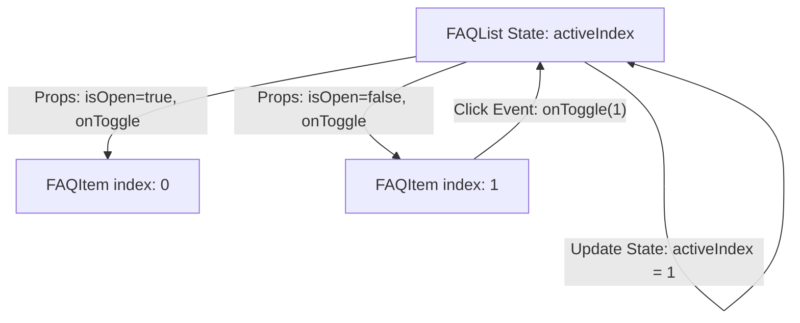

# Báo cáo Phân tích - Bài 10: FAQ Accordion (Lifting State Up - Nâng cao Trạng thái)

## 1. Tại sao cần giải pháp nâng trạng thái lên Component cha? (Lifting State Up)

Trong một hệ thống Accordion thông thường:
- Nếu mỗi `FAQItem` tự quản lý trạng thái đóng/mở (`isOpen`) của riêng nó (Local State), các Item hoạt động hoàn toàn độc lập. Người dùng có thể mở đồng thời tất cả các câu hỏi mà không có sự giao tiếp hay kiểm soát lẫn nhau.
- **Yêu cầu:** Tại một thời điểm, chỉ cho phép duy nhất một câu hỏi được mở. Khi một câu hỏi mới được nhấp vào, câu hỏi đang mở trước đó phải tự động đóng lại.
- **Giải pháp:** Để thực hiện logic loại trừ lẫn nhau này, các Component con cần chia sẻ trạng thái chung. Do đó, ta phải **Lifting State Up (Nâng cao Trạng thái)** lên Component cha (`FAQList`):
  - Component cha giữ một trạng thái duy nhất: `activeIndex` (Lưu chỉ số index của FAQItem đang mở, hoặc `null` nếu đóng hết).
  - Component cha tính toán xem Component con nào đang được mở thông qua phép so sánh: `isOpen = index === activeIndex`.
  - Component cha truyền giá trị `isOpen` và hàm callback `onToggle(index)` xuống cho từng Component con.

---

## 2. Kênh truyền dữ liệu và sự kiện (Data & Event Control Flow)

Sơ đồ luồng dữ liệu (Props Down - Events Up):

### Cách thức trao đổi:
- **Tập tin dữ liệu truyền xuống (React Props):**
  - `question` (String) và `answer` (String): Nội dung câu hỏi và câu trả lời.
  - `isOpen` (Boolean): Chỉ thị Item có được hiển thị câu trả lời hay không. Chỉ có cha mới quyết định được điều này.
  - `onToggle` (Function): Hàm callback do cha truyền xuống để con kích hoạt sự kiện khi người dùng click vào dòng tiêu đề.
- **Sự kiện truyền ngược (Event Callback):**
  - Khi người dùng click vào tiêu đề của con, con thực thi `onToggle()` (không tự thay đổi giao diện trực tiếp).
  - Cha nhận được lệnh gọi trong hàm `onToggle(index)`, tiến hành cập nhật State `activeIndex` của mình:
    - Nếu click trúng câu đang mở: Đóng lại (`activeIndex = null`).
    - Nếu click trúng câu khác: Chuyển vùng mở (`activeIndex = index`).
  - Giao diện được render lại với chỉ số mở mới.
