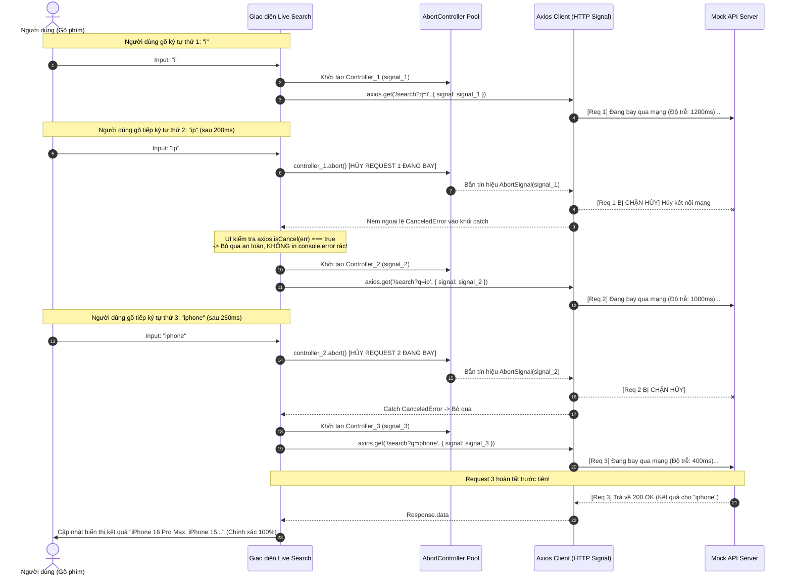

# SƠ ĐỒ LUỒNG DỮ LIỆU (SEQUENCE DIAGRAM): KỸ THUẬT HỦY REQUEST & CHỐNG RACE CONDITION

**Dự án**: P4.9 - Tối Ưu Hiệu Suất với Web API AbortController & Axios isCancel  
**Tác giả**: Lập trình viên Frontend  
**Mục tiêu**: Mô tả quá trình hủy bỏ các request đang bay dở dang khi người dùng gõ phím liên tục trong ô Live Search.

---

## 1. Sơ Đồ Tuần Tự (Sequence Diagram - Mermaid)



---

## 2. Giải Thích Cơ Chế Bẫy Dữ Liệu (Data Trap)

### Vấn đề:
Khi một request bị hủy bởi `controller.abort()`, Axios và Web API chuẩn sẽ coi đó là một lời từ chối và **ném một Exception vào khối `catch`**:
```typescript
// Ngoại lệ ném ra có dạng:
// AxiosError: canceled / CanceledError: canceled
```

### Hậu quả nếu không xử lý đúng:
Nếu lập trình viên chỉ viết:
```typescript
catch (err) {
  console.error("Lỗi mạng!", err); // RÁC CONSOLE!
  setError("Không thể tải kết quả tìm kiếm!"); // BÁO LỖI ẢO CHO USER!
}
```
Người dùng gõ 10 ký tự sẽ thấy màn hình nhấp nháy báo lỗi 9 lần!

### Giải pháp Chuẩn mực:
Sử dụng hàm phân loại chuyên dụng `axios.isCancel(err)`:
```typescript
try {
  const res = await axios.get('/search', { signal: controller.signal });
  setResults(res.data);
} catch (err) {
  if (axios.isCancel(err)) {
    // ĐÂY LÀ HÀNH VI CHỦ ĐỘNG HỦY CỦA HỆ THỐNG
    console.log("[Request Aborted]: Đã hủy bỏ request cũ thành công, không in lỗi.");
    return; // Dừng lại an toàn, không đổi UI!
  }
  // Các lỗi mạng thực sự khác:
  console.error("Lỗi mạng thực sự:", err);
  setErrorMessage("Không thể kết nối đến máy chủ.");
}
```

---

## 3. Ngăn Chặn Lỗi Race Condition
- **Không có Cancel**: Request 1 (tìm chữ "i") đi đường vòng mất 1500ms. Request 2 (tìm chữ "iphone") mất 400ms và về trước. Nhưng 1100ms sau, Request 1 mới về và ghi đè danh sách kết quả! &rarr; Người dùng đang gõ "iphone" nhưng màn hình lại hiện kết quả của chữ "i" (Lỗi Race Condition kinh điển).
- **Có Cancel**: Request 1 lập tức bị ngắt kết nối ngay khi người dùng gõ thêm chữ. Không bao giờ xảy ra tình trạng kết quả cũ ghi đè kết quả mới.
